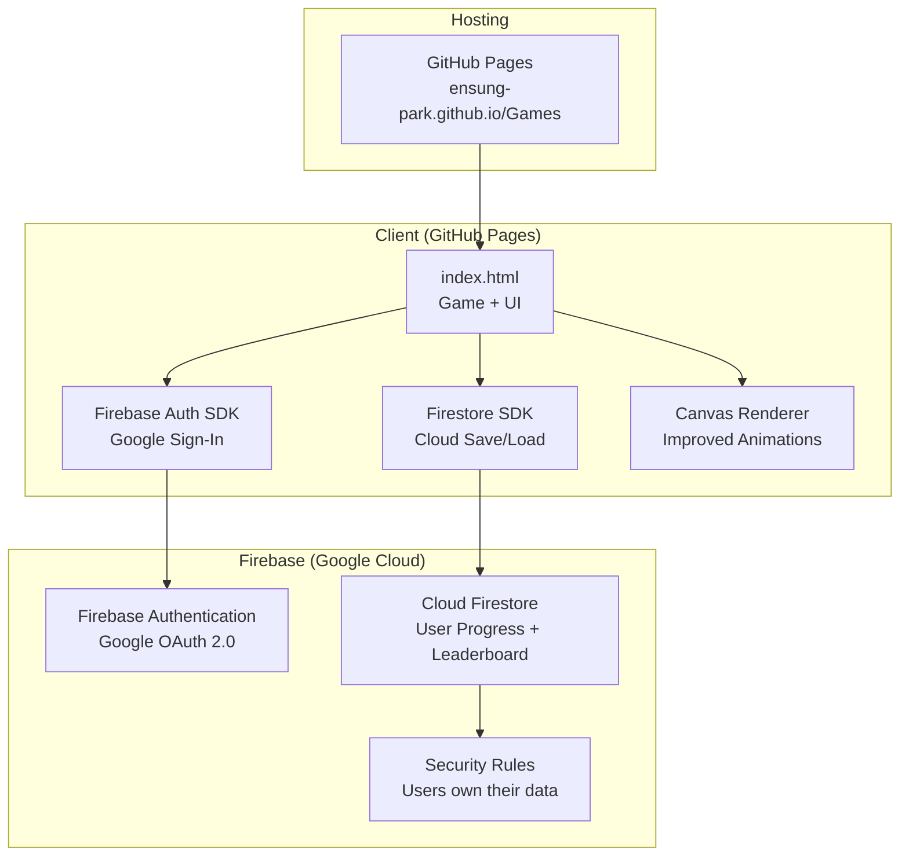
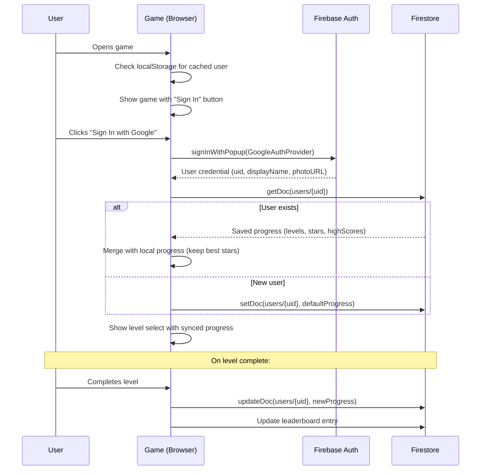
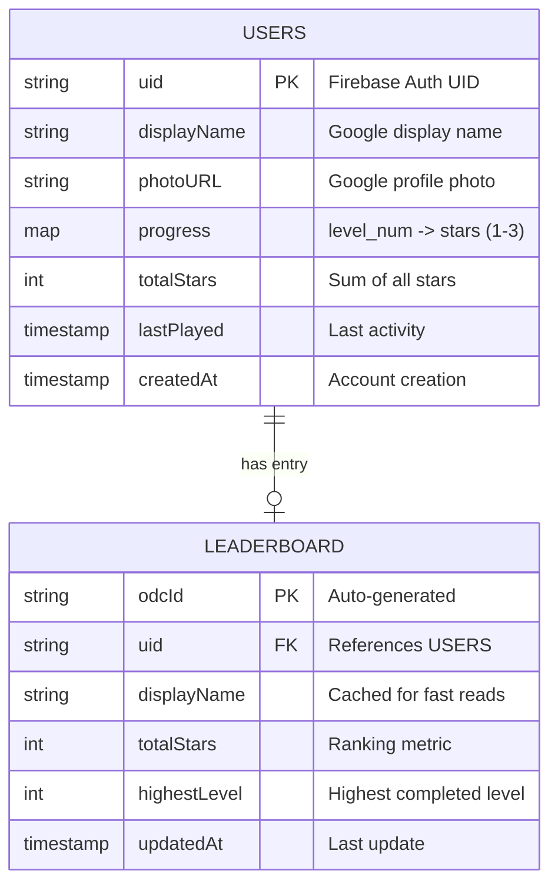
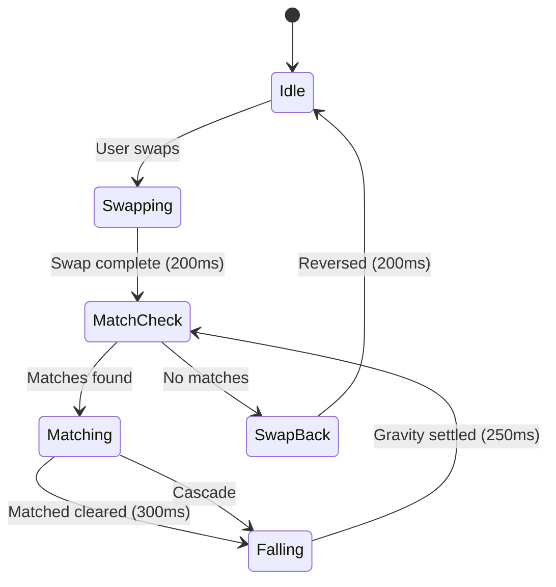
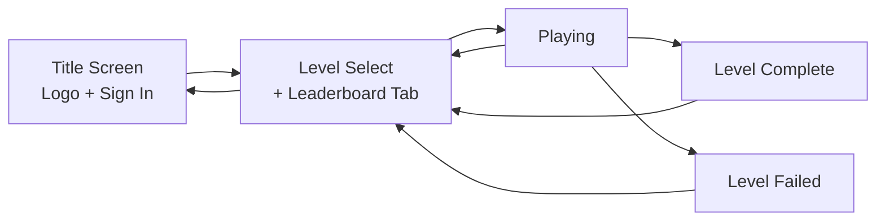

# Sweet Match v2: Cloud Save, Google Auth, Graphics Polish & Public Deploy

## Overview

Transform the Sweet Match game from a local single-player experience into a publicly accessible web game with Google account login, cloud-synced progress, improved visual animations, and a leaderboard. Deploy on GitHub Pages with Firebase for auth and data.

## Architecture



## Authentication Flow



## Data Model



### Firestore Collections

**`users/{uid}`** document:
```json
{
  "displayName": "John Doe",
  "photoURL": "https://...",
  "progress": { "1": 3, "2": 2, "3": 1 },
  "totalStars": 6,
  "highestLevel": 3,
  "lastPlayed": "<timestamp>",
  "createdAt": "<timestamp>"
}
```

**`leaderboard/{uid}`** document (denormalized for fast reads):
```json
{
  "uid": "abc123",
  "displayName": "John Doe",
  "photoURL": "https://...",
  "totalStars": 42,
  "highestLevel": 15,
  "updatedAt": "<timestamp>"
}
```

### Security Rules
```
rules_version = '2';
service cloud.firestore {
  match /databases/{database}/documents {
    match /users/{userId} {
      allow read: if request.auth != null;
      allow write: if request.auth != null && request.auth.uid == userId;
    }
    match /leaderboard/{userId} {
      allow read: if true;  // Public leaderboard
      allow write: if request.auth != null && request.auth.uid == userId;
    }
  }
}
```

## Graphics Improvements

### Current Problems
- No swap animation (candies teleport)
- No gravity/fall animation (candies appear instantly)
- No scale-in for new candies
- Match removal is instant (no satisfying dissolve)
- Screen shake uses random noise instead of smooth oscillation

### Animation System



**Tweened animations to add:**

| Animation | Duration | Easing | Description |
|-----------|----------|--------|-------------|
| Swap slide | 180ms | easeInOut | Two candies slide to each other's positions |
| Swap back | 180ms | easeInOut | Invalid swap reversal |
| Match dissolve | 300ms | easeOut | Scale to 1.3x then to 0, brightness increases |
| Gravity fall | 250ms per row | bounce | Candies drop with slight bounce at bottom |
| New candy enter | 200ms | easeOut | Scale from 0 to 1.05 to 1.0 |
| Special create | 350ms | bounce | Flash white, pulse scale 1.0 -> 1.3 -> 1.0 |
| Score popup | 800ms | easeOut | Float upward with fade, slight scale |

**Implementation approach:** Each cell gets optional `drawX`, `drawY`, `scale`, `alpha` properties. The game loop tweens these properties over time. When all animations complete, the next game phase begins.

## Game Screens (Updated)



### Title Screen (New)
- Game logo with animated candy background
- "Sign in with Google" button (styled, not the default Google button)
- "Play as Guest" option (uses localStorage only, no cloud save)
- If already signed in, auto-redirect to level select

### Level Select (Updated)
- User avatar + name in top-left (or "Guest" badge)
- "Leaderboard" tab showing top 20 players by total stars
- Sign out button
- Current grid layout preserved

### Leaderboard
- Top 20 players sorted by totalStars descending
- Shows rank, avatar, name, total stars, highest level
- Current user highlighted
- Refreshed on each view (Firestore query, ordered, limited to 20)

## File Structure

```
Games/
  sweet-match/
    index.html          (game - loads Firebase from CDN)
  firebase.json         (Firebase hosting config, optional)
  firestore.rules       (Firestore security rules)
  .firebaserc           (Firebase project config)
  README.md             (updated with game link + setup)
```

The game remains a single `index.html` file. Firebase SDKs are loaded from CDN (`https://www.gstatic.com/firebasejs/...`). No build step needed.

## Deployment

### GitHub Pages
- Repo must be **public** (or GitHub Pro for private Pages)
- Enable Pages in repo Settings -> Pages -> Source: "Deploy from a branch" -> `master` / `root`
- Game accessible at `https://ensung-park.github.io/Games/sweet-match/`

### Firebase Setup (One-time)
1. Create Firebase project at console.firebase.google.com
2. Enable Google Authentication provider
3. Create Firestore database
4. Deploy security rules
5. Add GitHub Pages domain to authorized domains
6. Copy Firebase config object into index.html

## Guest Mode
- Users who don't sign in play as "Guest"
- Progress saved to localStorage only (current behavior)
- Prompt to sign in on level complete: "Sign in to save your progress!"
- When guest signs in, merge local progress with cloud (keep higher stars)

## Non-Goals
- No real-time multiplayer gameplay
- No social features beyond leaderboard
- No payment/IAP
- No custom avatars (use Google profile photo)
- No push notifications
- No offline-first with sync queue (simple online-only cloud save)
